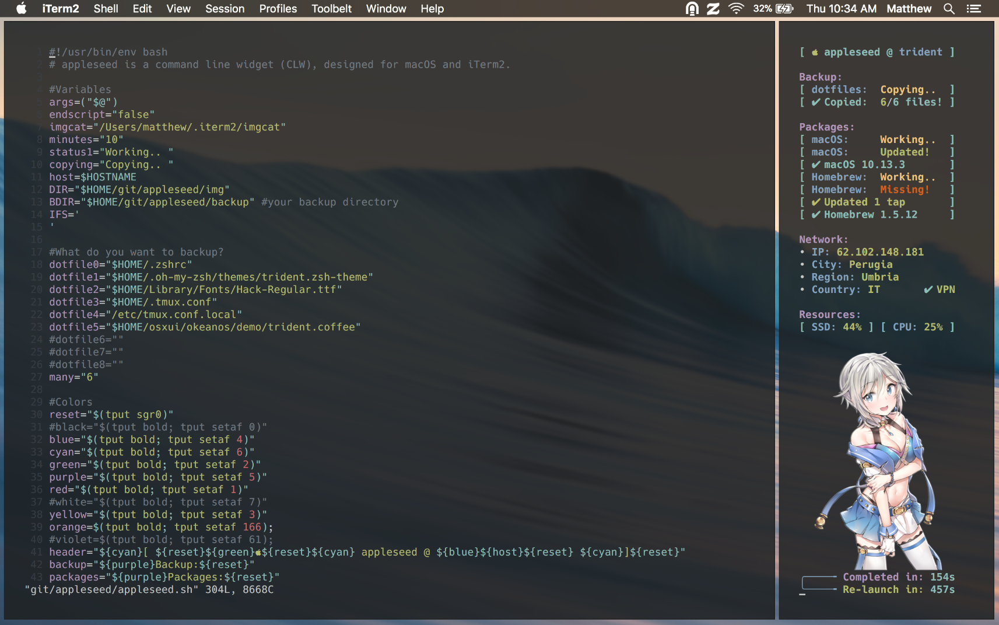

#### Desktop Configuration

My macOS (High Sierra) desktop

─── [reddit](https://redd.it/850z1e)

─── [Google+](https://plus.google.com/103376197601313389933/posts/BvfTGdpBJKf)

#### Table of Contents

* [Software](#Software)
* [Window Manager](#WindowManager)
* [Terminal](#Terminal)
* [appleseed](#appleseed)
* [Misc.](#Misc.)
* [Questions](#Questions)
* [License](#License)

#### Software

    Xcode
    iTerm2
    Homebrew
    zsh + oh-my-zsh
    vim
    Zephyros
    Okeanos
    gtop
    tty-clock
    cava (cli visualiser) + mosh (ssh)
    appleseed

This script is generally a good preparation step: [When I do a clean macOS installation.](https://github.com/mzdr/macOS) 

#### WindowManager
I have a pseudo tiling window manager configured using [Zephyros](https://github.com/sdegutis/zephyros) & [Okeanos](https://github.com/stayradiated/okeanos) together. This is a video demonstration from [stayradiated](https://github.com/stayradiated), the creator of `Okeanos`: 

>    "okeanos (ωκεανός) is Greek for the ocean (kind of obvious maybe) and zephyros (Ζέφυρος) is Greek for the
>     West wind" - u/saligari

#### Terminal
I've configured iTerm2 in a few ways to suit my liking. Simply import my [iTerm2 profile json](https://github.com/mattinclude/appleseed/tree/master/backup) or set up a few things manually. I imported the [Hybrid](https://github.com/mattinclude/appleseed/tree/master/backup) color preset. Under window settings, Transparency=19%, Style=No Title Bar and I'm using no Blurring. I'm using the [powerline patched](https://github.com/powerline/fonts) - [Hack font](https://github.com/mattinclude/appleseed/tree/master/backup) | A typeface designed for source code. I prefer `zsh`, and have provided my custom theme [trident.zsh-theme](https://github.com/mattinclude/appleseed/tree/master/backup). 

    PROMPT="%{$fg_bold[blue]%}───╼%{$reset_color%} "
    RPROMPT="%{$fg[cyan]%}ψ %M %{$fg[green]%}%~%{$reset_color%}"

#### appleseed

> [appleseed v1.0.0](https://github.com/mattinclude/appleseed) is a command line widget (CLW), I designed for macOS 
> and iTerm2. Its a flexible platform for process automation and added 
> eye candy. It utilizes imgcat to view image files inside the terminal 
> with the help of shell integration. • For best results, launch in a 
> tall by thin proportioned shell.

#### Misc.
I recommend the [Hybrid](https://github.com/mattinclude/appleseed/tree/master/backup) color theme for vim. In the macOS General settings, I use the Graphite Appearance, and the Dark Bar and Dock. The command line visualizer I am utilizing is [cava](https://github.com/karlstav/cava). You can also use [cli-visualizer](https://github.com/dpayne/cli-visualizer). I run the sofware over a `mosh` (persistant ssh) session to a Linux VM or instance. As for `tmux`, this is my [preferred config](https://github.com/mattinclude/etc-tmux). View the [Wallpaper](img/bg0.png).

#### Questions
Contact me at [matt@brassey.io](mailto:matt@brassey.io) with any questions or comments.

#### License
READMEGenesis is published under the __CC0_1.0_Universal__ license.

> The Creative Commons CC0 Public Domain Dedication waives copyright interest in a work you've created and dedicates it to the world-wide public domain. Use CC0 to opt out of copyright entirely and ensure your work has the widest reach. As with the Unlicense and typical software licenses, CC0 disclaims warranties. CC0 is very similar to the Unlicense.
